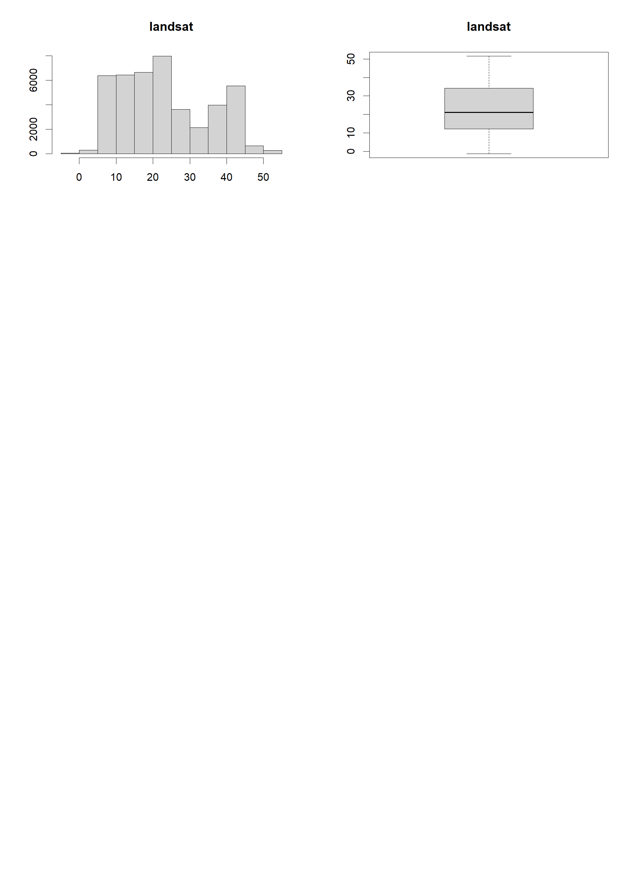

Progetto Environmental Data Analysis (MD2SL)
================
Mirko Verardo
24 gennaio 2025

``` r
# librerie per manipolazione dati
library(tidyverse)
library(corrplot)
# librerie per modeling
library(caret)
library(xgboost)
# librerie per gestione mappa
library(sf)
library(ggspatial)
```

# Lettura dataset

In questa sezione vengono letti tutti i dataset necessari per l’analisi.
In particolare:

- il dataset per il training, del quale sono state considerate solo le
  variabili presenti nel file *Descrizione_Predittori.docx*
- il dataset con la griglia sf della Toscana
- il dataset con i predittori per il comune di Firenze

``` r
# path current directory
PATH = "C:/Users/mirko/Desktop/md2sl/environmental_and_genomic_data_analysis/sera/Exercise"

file = paste(PATH, "dataTempTuscany_tmin.RData", sep="/")
load(file)

file = paste(PATH, "Tuscany_grid_sf.RData", sep="/")
load(file)
tuscanygridsp = tuscanygridsp %>% select(cellcode, geometry)

file = paste(PATH, "DF_predictor_FI_2022_183.rds", sep="/")
data_firenze = readRDS(file)

# tengo solo la geometria di firenze
data_firenze = data_firenze %>%
  inner_join(tuscanygridsp, by = c("cellcode"))
rm(tuscanygridsp)

# elenco predittori
predictors_all = c(
  "calllat",                             # latitudine del centroide della cella
  "calllong",                            # longitudine del centroide della cella
  "ibu",                                 # % area della cella con costruzioni non naturali
  "dem",                                 # altitudine
  "slp",                                 # pendenza
  "asp",                                 # direzione massima pendenza
  "svf",                                 # sky view factor
  "lenght_urbana",                         # lunghezza strade urbane
  "lenght_locale",                         # lunghezza strade locali
  "lenght_extraurbana_secondaria",  
  "lenght_extraurbana_principale", 
  "lenght_autostrada",              
  "lenght_altro",                  
  "pop",                                   # popolazione
  "ntl",                                   # night time light
  "Continuous_urban_fabric",         # % area urbana continua
  "Discontinuous_urban_fabric",      # % area urbana discontinua
  "Industrial_or_commercial_units",  # % area industriale o commerciale
  "Mineral_extraction_sites",        # % area miniera
  "Dump_sites",                      # % area discarica
  "Vegetation",                      # % area vegetazione
  "Agriculture",                     # % area agricoltura
  "Wet_land",                        # % area palude
  "Beaches_dunes_sands",             # % area spiaggia
  "Water",                           # % area acqua
  "isa",                             # % area impervious surface
  "SUNALT",                          # altezza del sole alle 12
  "AZIM",                            # azimuth alle 12
  "DAYL",                            # durata del giorno
  "DIFSUNRAD",                         # radiazione solare diffusa
  "DIRSUNRAD",                       # radiazione solare diretta
  "TMEAN",                           # ERA5-land temperatura media
  "PREC",                            # ERA5-land precipitazioni
  "RH",                              # ERA5-land umidità relativa
  "WINDS",                           # ERA5-land velocità del vento
  "WINDD",                           # ERA5-land direzione del vento
  "PA",                              # ERA5-pressione atmosferica
  "NDVI",                            # indice di vegetazione NDVI-da satellite
  "BLH",                             # ERA5-land planet bounday layer
  "DEW",                             # ERA5-land dew point temperature
  "LST_AD",                          # Satellite Aqua-MODIS LST day
  "LST_AN",                          # Satellite Aqua-MODIS LST night
  "LST_TD",                          # Satellite Terra-MODIS LST day
  "LST_TN",                          # Satellite Terra-MODIS LST night
  "ERA5_Tmax",                       # ERA5-land temperatura massima
  "ERA5_Tmin",                       # ERA5-land temperatura minima
  "centraline_w_mean_max",           # media delle 10 centraline vicine -tmax
  "centraline_w_mean_min",           # media delle 10 centraline vicine -tmin
  "landsat"                          # LST dal satellite Landsat 8-stagione
)

# tengo solo le variabili d'interesse
vars = c(
  "cellcode",                            # codice della cella 100mX100m
  "IDStazione",                          # codice della centralina
  "Data",                            # data della rilevazione
  "temp_min",                            # temperatura minima misurata dalla centralina
  predictors_all
)
DT.min = DT.min %>% select(all_of(vars))

# tengo solo le variabili d'interesse
vars = c(
  "cellcode", 
  "geometry", 
  predictors_all
)
data_firenze = data_firenze %>% select(all_of(vars))
```

# Analisi esplorativa

``` r
# inizialization
data = DT.min
response_var = "temp_min"

data = data %>%
  mutate(stagione = factor(case_when(
    month(Data) %in% c(12, 1, 2) ~ "inverno",
    month(Data) %in% c(3, 4, 5)  ~ "primavera",
    month(Data) %in% c(6, 7, 8)  ~ "estate",
    month(Data) %in% c(9, 10, 11) ~ "autunno"
  ), levels = c(
    "inverno", 
    "primavera", 
    "estate",
    "autunno"
  )))

data_firenze = data_firenze %>%
  mutate(stagione = factor("estate", levels = c(
    "inverno", 
    "primavera", 
    "estate",
    "autunno"
  )))

str(data)
```

    ## Classes 'data.table' and 'data.frame':   43982 obs. of  54 variables:
    ##  $ cellcode                      : chr  "tsc783972" "tsc692519" "tsc793011" "tsc567300" ...
    ##  $ IDStazione                    : chr  "TOS01000544" "TOS01000591" "TOS01000601" "TOS01000611" ...
    ##  $ Data                          : IDate, format: "2022-01-01" "2022-01-01" ...
    ##  $ temp_min                      : num  11 0 -0.3 8.4 9 3.3 5.5 4.7 4.2 5.9 ...
    ##  $ calllat                       : num  4840721 4846321 4840221 4854721 4843521 ...
    ##  $ calllong                      : num  613766 711066 721766 726566 736166 ...
    ##  $ ibu                           : num  49.02 4.46 10.02 7.74 19.96 ...
    ##  $ dem                           : num  6.49 733.58 377.42 1116.85 1138.8 ...
    ##  $ slp                           : num  0 16.05 2.34 7.53 17.12 ...
    ##  $ asp                           : num  240.2 133.7 99.9 214.6 205.5 ...
    ##  $ svf                           : num  0.999 0.944 0.973 0.97 0.975 ...
    ##  $ lenght_urbana                 : num  0 50.3 177.7 0 0 ...
    ##  $ lenght_locale                 : num  0 0 0 0 0 ...
    ##  $ lenght_extraurbana_secondaria : num  0 0 0 0 0 ...
    ##  $ lenght_extraurbana_principale : num  0 0 0 0 0 ...
    ##  $ lenght_autostrada             : num  0 0 0 0 0 0 0 0 0 0 ...
    ##  $ lenght_altro                  : num  0 0 0 0 0 ...
    ##  $ pop                           : num  55.2035 1.042 1.2064 0.0877 0.2698 ...
    ##  $ ntl                           : num  32.989 5.34 3.033 0.525 1.527 ...
    ##  $ Continuous_urban_fabric       : num  0 0 0 0 0 0 0 0 0 0 ...
    ##  $ Discontinuous_urban_fabric    : num  1 0.143 0 0 0 ...
    ##  $ Industrial_or_commercial_units: num  0 0 0 0 0 0 0 0 0 0 ...
    ##  $ Mineral_extraction_sites      : num  0 0 0 0 0 0 0 0 0 0 ...
    ##  $ Dump_sites                    : num  0 0 0 0 0 0 0 0 0 0 ...
    ##  $ Vegetation                    : num  0 0.857 0 1 1 ...
    ##  $ Agriculture                   : num  0 0 1 0 0 ...
    ##  $ Wet_land                      : num  0 0 0 0 0 0 0 0 0 0 ...
    ##  $ Beaches_dunes_sands           : num  0 0 0 0 0 0 0 0 0 0 ...
    ##  $ Water                         : num  0 0 0 0 0 0 0 0 0 0 ...
    ##  $ isa                           : num  58.9 7.1 16 10.4 18.7 ...
    ##  $ SUNALT                        : num  22.5 22.3 22.3 22.2 22.3 ...
    ##  $ AZIM                          : num  -11.4 -12.5 -12.7 -12.7 -12.8 ...
    ##  $ DAYL                          : num  8.81 8.8 8.81 8.79 8.81 ...
    ##  $ DIFSUNRAD                     : num  12.6 12.3 12.6 12.2 12 ...
    ##  $ DIRSUNRAD                     : num  217 105 231 217 110 ...
    ##  $ TMEAN                         : num  283 281 281 281 281 ...
    ##  $ PREC                          : num  8.26e-05 1.33e-04 1.05e-04 5.76e-05 3.92e-05 ...
    ##  $ RH                            : num  90.5 81.3 78.4 78.4 72.7 ...
    ##  $ WINDS                         : num  1.355 0.142 0.17 0.654 0.596 ...
    ##  $ WINDD                         : num  78.6 202 154.8 44 86.3 ...
    ##  $ PA                            : num  101483 95423 94688 94688 94783 ...
    ##  $ NDVI                          : num  0.379 0.617 0.503 0.736 0.496 ...
    ##  $ BLH                           : num  98.5 50.5 50.5 46.3 46.3 ...
    ##  $ DEW                           : num  281 278 277 277 276 ...
    ##  $ LST_AD                        : num  285 284 282 290 290 ...
    ##  $ LST_AN                        : num  281 281 278 279 279 ...
    ##  $ LST_TD                        : num  285 285 281 288 286 ...
    ##  $ LST_TN                        : num  278 277 277 283 279 ...
    ##  $ ERA5_Tmax                     : num  285 285 286 287 287 ...
    ##  $ ERA5_Tmin                     : num  281 277 277 278 278 ...
    ##  $ centraline_w_mean_max         : num  11.77 11.39 11.07 11.45 9.86 ...
    ##  $ centraline_w_mean_min         : num  9.79 3.62 3.96 2.39 2.62 ...
    ##  $ landsat                       : num  9.4 8.14 8.44 7.25 6.73 ...
    ##  $ stagione                      : Factor w/ 4 levels "inverno","primavera",..: 1 1 1 1 1 1 1 1 1 1 ...
    ##  - attr(*, ".internal.selfref")=<externalptr>

``` r
# range di date presenti nel dataset
data_days = data$Data
print(min(data_days))
```

    ## [1] "2022-01-01"

``` r
print(max(data_days))
```

    ## [1] "2022-12-19"

## Variabile risposta

``` r
# set visualization
par(mfrow = c(1, 2))

# response
data_response = data[[response_var]]
summary(data_response)
```

    ##    Min. 1st Qu.  Median    Mean 3rd Qu.    Max. 
    ##  -10.50    4.70   11.40   10.76   17.00   27.10

``` r
hist(data_response, main = "Histogram", xlab = response_var, ylab = "")
boxplot(data_response, main = "Boxplot", xlab = response_var, ylab = "")
```

<!-- -->

## Predittori

``` r
# set visualization
par(mfrow = c(4, 2), cex = 2)

# predictors plots
for (predictor in predictors_all) {
  hist(data[[predictor]], main = predictor, xlab = "", ylab = "")
  boxplot(data[[predictor]], main = predictor, xlab = "", ylab = "")
}
```

<!-- --><!-- --><!-- --><!-- --><!-- --><!-- --><!-- --><!-- --><!-- --><!-- --><!-- --><!-- -->

``` r
# reset visualization
par(mfrow = c(1, 1), cex = 1)
```

<!-- -->

I seguenti predittori contengono degli outlier potenzialmente poco
sensati:

- **LST_AD**: Satellite Aqua-MODIS LST day
- **LST_TD**: Satellite Terra-MODIS LST day

Anziché rimuovere le relative osservazioni o sostituirle con un valore
medio (ad esempio), è stato pensato di rimuovere questi predittori dal
modello in virtù del fatto che verranno inclusi invece **LST_AN** e
**LST_TN**, ovvero l’equivalente ma con i dati notturni (probabilmente
anche più significativi per le temperature minime).

# Selezione delle variabili

## Base

``` r
predictors = predictors_all
print(predictors)
```

    ##  [1] "calllat"                        "calllong"                      
    ##  [3] "ibu"                            "dem"                           
    ##  [5] "slp"                            "asp"                           
    ##  [7] "svf"                            "lenght_urbana"                 
    ##  [9] "lenght_locale"                  "lenght_extraurbana_secondaria" 
    ## [11] "lenght_extraurbana_principale"  "lenght_autostrada"             
    ## [13] "lenght_altro"                   "pop"                           
    ## [15] "ntl"                            "Continuous_urban_fabric"       
    ## [17] "Discontinuous_urban_fabric"     "Industrial_or_commercial_units"
    ## [19] "Mineral_extraction_sites"       "Dump_sites"                    
    ## [21] "Vegetation"                     "Agriculture"                   
    ## [23] "Wet_land"                       "Beaches_dunes_sands"           
    ## [25] "Water"                          "isa"                           
    ## [27] "SUNALT"                         "AZIM"                          
    ## [29] "DAYL"                           "DIFSUNRAD"                     
    ## [31] "DIRSUNRAD"                      "TMEAN"                         
    ## [33] "PREC"                           "RH"                            
    ## [35] "WINDS"                          "WINDD"                         
    ## [37] "PA"                             "NDVI"                          
    ## [39] "BLH"                            "DEW"                           
    ## [41] "LST_AD"                         "LST_AN"                        
    ## [43] "LST_TD"                         "LST_TN"                        
    ## [45] "ERA5_Tmax"                      "ERA5_Tmin"                     
    ## [47] "centraline_w_mean_max"          "centraline_w_mean_min"         
    ## [49] "landsat"

``` r
# predittori che contengono outlier
predictors_del = c("LST_AD", "LST_TD")
predictors = predictors[!(predictors %in% predictors_del)]

# predittori poco informativi
predictors_del = nearZeroVar(data[, ..predictors], names=T, saveMetrics=T) %>% 
  filter(nzv) %>% 
  rownames()
predictors = predictors[!(predictors %in% predictors_del)]

# nessuna combinazione lineare da togliere
print(findLinearCombos(data[, ..predictors]))
```

    ## $linearCombos
    ## list()
    ## 
    ## $remove
    ## NULL

``` r
# predittori che secondo me non servono
predictors_del = c("calllat", "calllong", "centraline_w_mean_max")
predictors = predictors[!(predictors %in% predictors_del)]
print(predictors)
```

    ##  [1] "dem"                   "asp"                   "svf"                  
    ##  [4] "pop"                   "ntl"                   "Vegetation"           
    ##  [7] "Agriculture"           "SUNALT"                "AZIM"                 
    ## [10] "DAYL"                  "DIFSUNRAD"             "DIRSUNRAD"            
    ## [13] "TMEAN"                 "PREC"                  "RH"                   
    ## [16] "WINDS"                 "WINDD"                 "PA"                   
    ## [19] "NDVI"                  "BLH"                   "DEW"                  
    ## [22] "LST_AN"                "LST_TN"                "ERA5_Tmax"            
    ## [25] "ERA5_Tmin"             "centraline_w_mean_min" "landsat"

Oltre ai predittori contenenti outlier poco sensati, sono stati rimossi
alcuni predittori poco informativi nel dataset (pochi valori univoci e
valore più frequente presente in oltre il 95% delle osservazioni).  
Inoltre, è stato ritenuto opportuno rimuovere i valori di **latitudine**
e **longitudine**.  
Infine, per un ragionamento simile a quello fatto per LST_AD e LST_TD, è
stato ritenuto opportuno rimuovere anche **centraline_w_mean_max**
(media tmax delle 10 centraline vicine).

## Gestione Multicollinearità

``` r
formula = paste(response_var, paste(predictors, collapse = " + "), sep=" ~ ")
model = lm(as.formula(formula), data)
print(paste("VIF (all):", mean(car::vif(model))))
```

    ## [1] "VIF (all): 134.463997510685"

``` r
corr_predictors = cor(data[, ..predictors], method="pearson")
corrplot(corr_predictors, type="upper", tl.col="black", tl.srt=45, tl.cex=0.5)
```

<!-- -->

``` r
predictors_del = findCorrelation(corr_predictors, cutoff=0.9, names=T)
predictors_sel = predictors[!(predictors %in% predictors_del)]

formula = paste(response_var, paste(predictors_sel, collapse = " + "), sep=" ~ ")
model = lm(as.formula(formula), data)
print(paste("VIF (sel):", mean(car::vif(model))))
```

    ## [1] "VIF (sel): 4.16135922213434"

``` r
corr_predictors = cor(data[, ..predictors_sel], method="pearson")
corrplot(corr_predictors, type="upper", tl.col="black", tl.srt=45, tl.cex=0.5)
```

<!-- -->

``` r
print(predictors_sel)
```

    ##  [1] "dem"         "asp"         "svf"         "pop"         "ntl"        
    ##  [6] "Vegetation"  "Agriculture" "AZIM"        "DIRSUNRAD"   "PREC"       
    ## [11] "RH"          "WINDS"       "WINDD"       "PA"          "NDVI"       
    ## [16] "BLH"         "DEW"         "LST_AN"      "LST_TN"      "landsat"

È stata misurata la multicollinearità attraverso l’indice **VIF
(Variance Inflance Factor)** che risulta molto elevato. Anche la matrice
di correlazione mostra elevata correlazione tra diverse coppie di
predittori.  
In seguito alla rimozione dei predittori con correlazione superiore a
0.9, l’indice VIF risulta inferiore a 5 e, per tanto, mostra un livello
di multicollinearità accettabile.

# Training

## Funzioni di supporto

Da notare, il cambio della funzione di **standardizzazione**, basata sui
valori del training set.

``` r
# max-min standardization
normalize = function(X, mins = c(), maxs = c()) {
  if (length(mins) == 0)
    mins = min(X)
  
  if (length(maxs) == 0)
    maxs = max(X)
  
  return ((X - mins) / (maxs - mins))
}

# check the model performance
check_ml_model = function(ml_model, X, y) {
  y_pred = predict(ml_model, X)
  metrics = postResample(y_pred, y)
  return(metrics)
}

# check the model on firenze temperatures map
check_ml_model_firenze = function(ml_model, data, features, title) {
  # add predictions
  data = data %>% mutate(temp = predict(ml_model, features))
  
  # need to convert it to an sf object for the map
  data = st_as_sf(data)
  
  # colors
  colors = c("darkblue", "cyan3", "lightyellow")
  
  # get the plot
  p = ggplot(data = data) +
    geom_sf(aes(fill = temp, color = temp)) +
    scale_fill_gradientn(colors = colors, values = c(0, 0.5, 1)) +
    scale_color_gradientn(colors = colors, values = c(0, 0.5, 1)) +
    theme_minimal() +
    ggtitle(title)
  
  # return the plot
  return (p)
}
```

## Standardizzazione

La standardizzazione verrà eseguita sia per i predittori filtrati dopo
la gestione di multicollinearità, sia per i predittori prima.

``` r
SEED = 2025

# TRAINING-TEST SPLITTING
set.seed(SEED)
random.test = runif(nrow(data))
test = data[random.test >= 0.7, ]
train = data[random.test < 0.7, ]

# OUTCOMES
train.outcome = train[[response_var]]
test.outcome = test[[response_var]]

# TRAINING
train.features = train[, ..predictors]
train.features.range = list(
  min = apply(train.features, 2, min),
  max = apply(train.features, 2, max)
)
train.features_sel = train[, ..predictors_sel]
train.features_sel.range = list(
  min = apply(train.features_sel, 2, min),
  max = apply(train.features_sel, 2, max)
)

# TEST
test.features = test[, ..predictors]
test.features_sel = test[, ..predictors_sel]

# TRAINING STANDARDIZATION
train.features = mapply(
  normalize,
  train.features,
  mins = train.features.range$min,
  maxs = train.features.range$max
)
train.features_sel = mapply(
  normalize,
  train.features_sel,
  mins = train.features_sel.range$min,
  maxs = train.features_sel.range$max
)

# TEST STANDARDIZATION
test.features = mapply(
  normalize,
  test.features,
  mins = train.features.range$min,
  maxs = train.features.range$max
)
test.features_sel = mapply(
  normalize,
  test.features_sel,
  mins = train.features_sel.range$min,
  maxs = train.features_sel.range$max
)

train.features = cbind(train.features, train$stagione)
train.features_sel = cbind(train.features_sel, train$stagione)
test.features = cbind(test.features, test$stagione)
test.features_sel = cbind(test.features_sel, test$stagione)

# TRAINING STANDARDIZATION DATAFRAME
train.features = as.data.frame(train.features)
train.features_sel = as.data.frame(train.features_sel)

# TEST STANDARDIZATION DATAFRAME
test.features = as.data.frame(test.features)
test.features_sel = as.data.frame(test.features_sel)

# TRAINING PARAMS
step_control = trainControl(
  method="repeatedcv",
  repeats=5,
  number=5, 
  returnResamp="final"
)
```

Da notare che per i modelli **Lineare**, **Stepwise Forward** ed
**Elastic Net**, il processo di **cross-validation** viene ripetuto con
diverse suddivisioni.

## Modello Lineare

Sono state inserite nel modello solo i predittori selezionati in seguito
alla gestione di multicollinearità.

``` r
set.seed(SEED)

# get the model and check on train, test and firenze
linear_model = train(train.features_sel, train.outcome, "lm", 
                     trControl = step_control)

# print metrics
train_m = check_ml_model(linear_model, train.features_sel, train.outcome)
test_m = check_ml_model(linear_model, test.features_sel, test.outcome)
df = as.data.frame(rbind(train_m, test_m), row.names = c("TRAIN", "TEST"))
print(df)
```

    ##           RMSE  Rsquared      MAE
    ## TRAIN 2.224296 0.9050561 1.749244
    ## TEST  2.281121 0.9004938 1.793720

``` r
# print coefs
coefs = coef(linear_model$finalModel)
df = as.data.frame(coefs[-1])
colnames(df) = c("COEFFICIENTS")
print(df %>% arrange(-abs(COEFFICIENTS)))
```

    ##             COEFFICIENTS
    ## DEW           20.7930873
    ## LST_AN         8.4816841
    ## PREC           5.9275266
    ## RH            -5.9026773
    ## svf           -5.4854941
    ## LST_TN         5.2134925
    ## WINDS          2.9183446
    ## BLH            1.5652820
    ## pop            1.5494560
    ## ntl            1.5482192
    ## NDVI           1.2750121
    ## dem            1.1422282
    ## PA             1.1035848
    ## landsat        1.1018899
    ## AZIM           0.8040421
    ## WINDD          0.6038689
    ## Agriculture    0.3479937
    ## Vegetation    -0.3311312
    ## DIRSUNRAD     -0.2524003
    ## V21           -0.2000373
    ## asp            0.1965641

## Modello Stepwise Forward

Sono state inserite nel modello solo i predittori selezionati in seguito
alla gestione di multicollinearità.

``` r
set.seed(SEED)

# set the params
step_grid = data.frame(nvmax = 1:length(train.features_sel))

# get the model and check on train, test and firenze
leapf_model = train(train.features_sel, train.outcome, "leapForward", 
                    tuneGrid = step_grid, trControl = step_control)
# plot results
p = plot(leapf_model)
print(p)
```

<!-- -->

``` r
# print metrics
train_m = check_ml_model(leapf_model, train.features_sel, train.outcome)
test_m = check_ml_model(leapf_model, test.features_sel, test.outcome)
df = as.data.frame(rbind(train_m, test_m), row.names = c("TRAIN", "TEST"))
print(df)
```

    ##           RMSE  Rsquared      MAE
    ## TRAIN 2.224296 0.9050561 1.749244
    ## TEST  2.281121 0.9004938 1.793720

``` r
# print coefs
coefs = coef(leapf_model$finalModel, unlist(leapf_model$bestTune))
df = as.data.frame(coefs[-1])
colnames(df) = c("COEFFICIENTS")
print(df %>% arrange(-abs(COEFFICIENTS)))
```

    ##             COEFFICIENTS
    ## DEW           20.7930873
    ## LST_AN         8.4816841
    ## PREC           5.9275266
    ## RH            -5.9026773
    ## svf           -5.4854941
    ## LST_TN         5.2134925
    ## WINDS          2.9183446
    ## BLH            1.5652820
    ## pop            1.5494560
    ## ntl            1.5482192
    ## NDVI           1.2750121
    ## dem            1.1422282
    ## PA             1.1035848
    ## landsat        1.1018899
    ## AZIM           0.8040421
    ## WINDD          0.6038689
    ## Agriculture    0.3479937
    ## Vegetation    -0.3311312
    ## DIRSUNRAD     -0.2524003
    ## V21           -0.2000373
    ## asp            0.1965641

## Modello Elastic Net

Sono state inserite nel modello i predittori selezionati prima della
gestione di multicollinearità.  
Infatti, il modello Elastic Net è poco sensibile a multicollinearità e
riesce a gestire anche variabili correlate tra loro.  
In particolare:

- $\alpha \in [0, 1]$: bilanciamento tra Ridge ($\alpha = 0$) e Lasso
  ($\alpha = 1$):
  - $\alpha = 0$: solo Ridge (regolarizzazione **L2**).
  - $\alpha = 1$: solo Lasso (regolarizzazione **L1**).
  - $0 < \alpha < 1$: sia Ridge sia Lasso (**Elastic Net**).
- $\lambda \geq 0$: parametro che regola il peso complessivo della
  penalizzazione.

``` r
set.seed(SEED)

# set the params
step_grid = expand.grid(
  alpha = seq(0, 1, by = 0.1), # Ridge-Lasso (0-1) regression
  lambda = seq(0.5, 1.5, by = 0.1) # Grid of lambda values to test
)

# get the model and check on train, test and firenze
glmnet_model = train(train.features, train.outcome, "glmnet", 
                     tuneGrid = step_grid, trControl = step_control)
# plot results
p = plot(glmnet_model)
print(p)
```

<!-- -->

``` r
# print metrics
train_m = check_ml_model(glmnet_model, train.features, train.outcome)
test_m = check_ml_model(glmnet_model, test.features, test.outcome)
df = as.data.frame(rbind(train_m, test_m), row.names = c("TRAIN", "TEST"))
print(df)
```

    ##           RMSE  Rsquared      MAE
    ## TRAIN 1.968696 0.9260819 1.545116
    ## TEST  2.014846 0.9228286 1.587466

``` r
# print coefs (S4 object)
fm = glmnet_model$finalModel

print(glmnet_model$bestTune)
```

    ##    alpha lambda
    ## 12   0.1    0.5

``` r
print(fm$lambdaOpt)
```

    ## [1] 0.5

``` r
coefs = as.matrix(coef(fm, fm$lambdaOpt))
df = as.data.frame(coefs[-1, ])
colnames(df) = c("COEFFICIENTS")
print(df %>% arrange(-abs(COEFFICIENTS)))
```

    ##                       COEFFICIENTS
    ## centraline_w_mean_min  13.70509932
    ## ERA5_Tmin               5.00924788
    ## LST_AN                  4.72668922
    ## DEW                     4.16795864
    ## LST_TN                  2.74772938
    ## TMEAN                   2.52674600
    ## PREC                    2.42001181
    ## ERA5_Tmax               1.97506727
    ## svf                    -1.80193508
    ## WINDS                   1.28495181
    ## pop                     0.83621139
    ## ntl                     0.75046754
    ## NDVI                    0.36282234
    ## PA                      0.21338149
    ## BLH                     0.20806957
    ## WINDD                   0.16105254
    ## Agriculture             0.06406904
    ## Vegetation             -0.03347345
    ## dem                     0.00000000
    ## asp                     0.00000000
    ## SUNALT                  0.00000000
    ## AZIM                    0.00000000
    ## DAYL                    0.00000000
    ## DIFSUNRAD               0.00000000
    ## DIRSUNRAD               0.00000000
    ## RH                      0.00000000
    ## landsat                 0.00000000
    ## V28                     0.00000000

## Modello xGBoost

Sono state inserite nel modello i predittori selezionati prima della
gestione di multicollinearità.  
Infatti, il modello xGBoost è poco sensibile a multicollinearità e
riesce a gestire anche variabili correlate tra loro.

``` r
set.seed(SEED)

# set the params
xgb.params = list(
  objective = "reg:squarederror",
  booster = "gbtree",
  eval_metric = "rmse",
  eta = 0.1,
  min_child_weight = 100,
  max_depth = 10,
  subsample = 0.7,
  colsample_bytree = 0.7,
  gamma = 0.01
)

# get the model
xgb_model = xgb.train(
  params = xgb.params, 
  data = xgb.DMatrix(
    data = as.matrix(train.features),
    label = train.outcome
  ), 
  nrounds = 1000
)

# print metrics
train_m = check_ml_model(xgb_model, as.matrix(train.features), train.outcome)
test_m = check_ml_model(xgb_model, as.matrix(test.features), test.outcome)
df = as.data.frame(rbind(train_m, test_m), row.names = c("TRAIN", "TEST"))
print(df)
```

    ##            RMSE  Rsquared       MAE
    ## TRAIN 0.4315575 0.9964338 0.3295154
    ## TEST  0.9466960 0.9828587 0.7186502

``` r
# print gain
df = xgb.importance(feature_names = c(predictors, "stagione"), model = xgb_model)
print(df)
```

    ##                   Feature         Gain        Cover    Frequency
    ##                    <char>        <num>        <num>        <num>
    ##  1: centraline_w_mean_min 7.224627e-01 0.0604881059 0.0515275715
    ##  2:                 TMEAN 1.215988e-01 0.0326241183 0.0283858035
    ##  3:             ERA5_Tmin 6.158620e-02 0.0433454594 0.0356701806
    ##  4:                LST_AN 2.182536e-02 0.0455181839 0.0446011490
    ##  5:                   dem 9.495814e-03 0.0305401346 0.0467309792
    ##  6:                   ntl 6.363931e-03 0.0245213423 0.0371556924
    ##  7:                   pop 6.033918e-03 0.0253835170 0.0362250103
    ##  8:                   asp 5.977637e-03 0.0242676005 0.0369767151
    ##  9:                   DEW 5.515979e-03 0.0406724566 0.0363681922
    ## 10:                   svf 5.026135e-03 0.0233368396 0.0357596692
    ## 11:                    PA 4.219276e-03 0.0573855828 0.0499346733
    ## 12:                  PREC 3.877640e-03 0.0426202908 0.0495767186
    ## 13:                  NDVI 2.761023e-03 0.0376248548 0.0434735919
    ## 14:                 WINDS 2.526922e-03 0.0641802578 0.0518676284
    ## 15:               landsat 2.343005e-03 0.0248079310 0.0311778498
    ## 16:           Agriculture 2.104761e-03 0.0052244328 0.0109892077
    ## 17:                LST_TN 2.072258e-03 0.0379725676 0.0409500116
    ## 18:                    RH 2.048717e-03 0.0542944722 0.0469457520
    ## 19:             ERA5_Tmax 1.982017e-03 0.0380063366 0.0349721690
    ## 20:                   BLH 1.704480e-03 0.0500840441 0.0414511481
    ## 21:             DIFSUNRAD 1.500810e-03 0.0358097188 0.0339519983
    ## 22:                 WINDD 1.453405e-03 0.0466728880 0.0463909223
    ## 23:             DIRSUNRAD 1.388192e-03 0.0413194857 0.0386591019
    ## 24:                  AZIM 1.193869e-03 0.0458751426 0.0350795554
    ## 25:            Vegetation 1.042973e-03 0.0045950995 0.0058704562
    ## 26:                  DAYL 1.006960e-03 0.0279876464 0.0242156319
    ## 27:                SUNALT 8.368317e-04 0.0342755735 0.0241261432
    ## 28:              stagione 5.039764e-05 0.0005659168 0.0009664775
    ##                   Feature         Gain        Cover    Frequency

# Predizione su Firenze

``` r
#, eval=FALSE

features = data_firenze[, ..predictors]
features_sel = data_firenze[, ..predictors_sel]

# STANDARDIZATION
features = mapply(
  normalize,
  features,
  mins = train.features.range$min,
  maxs = train.features.range$max
)
features_sel = mapply(
  normalize,
  features_sel,
  mins = train.features_sel.range$min,
  maxs = train.features_sel.range$max
)

features = cbind(features, data_firenze$stagione)
features_sel = cbind(features_sel, data_firenze$stagione)

# STANDARDIZATION DATAFRAME
features = as.data.frame(features)
features_sel = as.data.frame(features_sel)

# set common title
title = paste("Firenze", response_var, sep=" - ")

t = paste(title, "Linear", sep = " - ")
p = check_ml_model_firenze(linear_model, data_firenze, features_sel, t)
print(p)
```

<!-- -->

``` r
t = paste(title, "Stepwise Forward", sep = " - ")
p = check_ml_model_firenze(leapf_model, data_firenze, features_sel, t)
print(p)
```

<!-- -->

``` r
t = paste(title, "Elastic Net", sep = " - ")
p = check_ml_model_firenze(glmnet_model, data_firenze, features, t)
print(p)
```

<!-- -->

``` r
t = paste(title, "XGBoost", sep = " - ")
p = check_ml_model_firenze(xgb_model, data_firenze, as.matrix(features), t)
print(p)
```

<!-- -->
